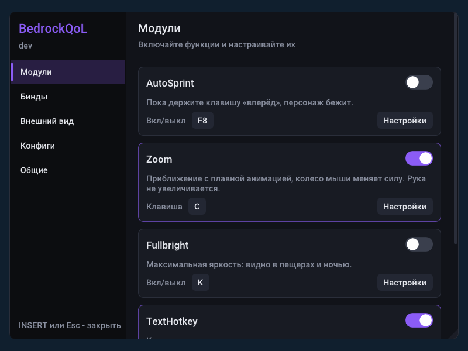
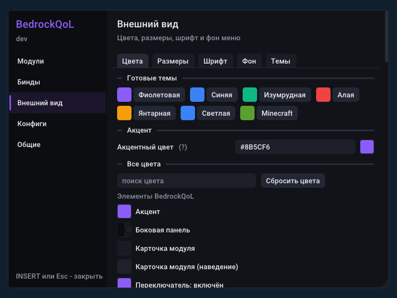
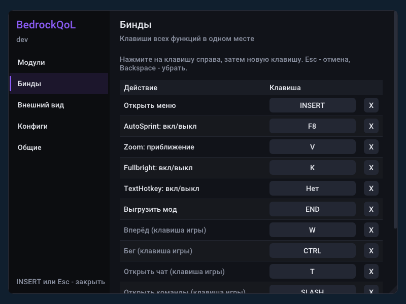

# BedrockQoL для Minecraft Bedrock (Windows) 1.21.51

DLL-мод для **Minecraft for Windows (Bedrock Edition) 1.21.51** (вся ветка 1.21.5x) с меню внутри игры
и фоновый лаунчер, который сам загружает мод в игру и обновляет его с GitHub.



## Возможности

| Функция | Клавиша по умолчанию | Что делает |
|---|---|---|
| **Меню** | **INSERT** (меняется) | Меню поверх игры: модули с переключателями и настройками, бинды, внешний вид (фон, все цвета, размеры, шрифт), конфиги. |
| **AutoSprint** | **F8** вкл/выкл | Пока держите **W**, игра считает, что зажата клавиша бега (**Ctrl**). |
| **Zoom** | держать **C** | Приближение в 4 раза с плавной анимацией. **Колесо мыши** во время зума меняет силу, хотбар не прокручивается. Рука не увеличивается. |
| **Fullbright** | не назначена (`.bind <клавиша> fullbright`) | Максимальная яркость (как Fullbright во Flarial), значение `Gamma` настраивается. |
| **TextHotkey** | свои клавиши | Клавиша отправляет в чат заданный текст или выполняет команду мода (если текст начинается с префикса). |
| **Команды в чате** | префикс **`.`** (меняется) | `.bind`, `.toggle`, `.config` и др. Сообщение с командой **не уходит на сервер**. |
| **Конфиги** | меню или `.config ...` | Сохранение, загрузка, экспорт и импорт профилей настроек (вместе с внешним видом меню). |
| **Уведомления в игре** | | Ответы на команды и включение/выключение функций показываются в углу экрана. |
| **Лаунчер** | работает в фоне | Сам загружает мод при запуске игры и ставит обновления с GitHub прямо в запущенную игру. |
| Выгрузка | **END** | Снимает хуки и выгружает мод без перезапуска игры. |

## Быстрый старт

1. Скачайте из [`release/`](release/) (или из [GitHub Releases](https://github.com/Showqus/alt-project/releases/tag/latest))
   файлы `BedrockQoL.dll` и `BedrockQoLLauncher.exe`, положите их в одну папку.
2. Запустите `BedrockQoLLauncher.exe`. Окна у него нет: появится иконка в трее (правый клик = меню).
3. Запустите Minecraft 1.21.51. Через 5 секунд мод загрузится сам, и придёт уведомление Windows «BedrockQoL загружен».
4. В игре нажмите **INSERT**: откроется меню. Список команд чата: `.help`.

Чтобы лаунчер стартовал вместе с Windows, включите в меню трея **«Запускать вместе с Windows»**.

## Меню в игре

**INSERT** открывает и закрывает меню, **Esc** тоже закрывает. Пока меню открыто, клавиатура и мышь
принадлежат ему: игра их не получает, а клавиши, которые были зажаты (бег, W, ЛКМ), отпускаются. Если меню
открыто в мире, где курсор скрыт, мод рисует свой курсор. Меню также открывает команда `.menu`.

* **Модули.** Карточка на каждую функцию: переключатель, клавиша и кнопка «Настройки» со всеми параметрами
  (сила и плавность зума, колесо мыши, Gamma для Fullbright, пауза и список TextHotkey, префикс команд чата и т.д.).
* **Бинды.** Все клавиши в одной таблице: меню, AutoSprint, Zoom, Fullbright, TextHotkey, выгрузка, клавиши
  игры и каждая TextHotkey. Нажмите на клавишу справа и затем новую клавишу; **Esc** отменяет,
  **Backspace**/**Delete** убирает клавишу, **X** тоже. Одна клавиша на нескольких действиях помечается «(!)».
* **Внешний вид.**
  * *Цвета:* 7 готовых тем (фиолетовая, синяя, изумрудная, алая, янтарная, светлая, Minecraft), акцентный цвет
    одним ползунком и **каждый цвет** меню отдельно (все цвета ImGui и элементов BedrockQoL, с поиском).
  * *Размеры:* масштаб всего меню, ширина и высота окна, непрозрачность, отступы, скругления, рамки,
    промежутки, толщина прокрутки, размеры ползунков.
  * *Шрифт:* встроенный Roboto (с кириллицей), любой шрифт Windows (`C:\Windows\Fonts`) или свой файл
    из папки `fonts`, размер. Символы, которых нет в выбранном шрифте, берутся из встроенного.
  * *Фон:* картинка PNG/JPG/BMP/TGA/GIF из папки `images` в окне меню или на весь экран; размещение
    (заполнить, вписать, растянуть, по центру, плиткой), непрозрачность, затемнение игры за меню и его цвет.
  * *Темы:* сохранить текущий вид как JSON (`themes\<имя>.json`), применить, удалить, сбросить к стандартному.
    Файлами тем можно делиться.
* **Конфиги.** Сохранить новый, загрузить, перезаписать, экспортировать, удалить, импортировать. Конфиг
  содержит **все** настройки, включая внешний вид меню.
* **Общие.** Работа функций только в мире, уведомления в игре, анимация меню, клавиши меню и выгрузки,
  кнопки «Перечитать config.ini» и «Выгрузить мод», состояние перехватов и путь к папке настроек.

| | |
|---|---|
|  |  |

Игра (UWP) может читать только свою папку, поэтому свои шрифты и картинки кладите в папки `fonts` и `images`
внутри папки настроек (меню показывает путь и копирует его в буфер обмена) или выберите файл в меню лаунчера
**«Фон для меню игры...»** / **«Шрифт для меню игры...»**: лаунчер скопирует его туда и сразу применит.

Меню рисуется через перехват `IDXGISwapChain::Present` (Direct3D 11 и Direct3D 12) и работает на тех же
данных, что и команды: всё, что меняется в меню, сразу записывается в `config.ini`.

## Команды в чате

Откройте чат (**T**), напишите команду, нажмите Enter. Сообщение не отправляется на сервер: мод перехватывает его,
закрывает чат и выполняет команду. Ответ показывается в игре (уведомление в углу экрана), приходит уведомлением
Windows (через лаунчер) и пишется в лог.

| Команда | Что делает |
|---|---|
| `.help` | список команд |
| `.bind <клавиша> <функция>` | привязать клавишу, например `.bind K fullbright`, `.bind V zoom`. Порядок аргументов любой. |
| `.unbind <функция или клавиша>` | снять привязку |
| `.binds` | все привязки и состояния |
| `.toggle <функция>` или просто `.<функция>` | включить/выключить (`.toggle fullbright`, `.fullbright`) |
| `.prefix <символы>` | сменить префикс, например `.prefix ;`, дальше команды пишутся как `;bind K zoom` |
| `.th add <клавиша> <текст>` | TextHotkey: `.th add F6 gg`. Если текст начинается с префикса, это команда: `.th add F7 .toggle zoom`. |
| `.th list`, `.th remove <номер или клавиша>`, `.th clear` | управление TextHotkey |
| `.config save <имя>` / `load <имя>` / `delete <имя>` / `list` | профили настроек (папка `configs`) |
| `.config export <имя>` | копия профиля (или текущих настроек) в папку `exports` |
| `.config import <имя>` | загрузить `imports\<имя>.ini` (удобнее через меню лаунчера «Импорт конфига...») |
| `.set <Секция.Ключ> <значение>`, `.get <Секция.Ключ>` | любая настройка из `config.ini`, например `.set Zoom.Factor 6`, `.set Fullbright.Gamma 10` |
| `.menu` | открыть/закрыть меню |
| `.theme save <имя>` / `load <имя>` / `delete <имя>` / `list` | темы меню в JSON (папка `themes`) |
| `.theme preset <имя>`, `.theme reset` | готовая тема (`.theme preset Minecraft`) / стандартный внешний вид |
| `.version`, `.unload` | версия / выгрузить мод |

Функции для `.bind`: `autosprint`, `zoom`, `fullbright`, `texthotkey`, `menu`, `unload`
(для `.toggle` — первые четыре).
Клавиши: `A`–`Z`, `0`–`9`, `F1`–`F24`, `CTRL`, `SHIFT`, `ALT`, `SPACE`, `TAB`, `END`, `HOME`, `INSERT`,
`DELETE`, `PAGEUP`, `PAGEDOWN`, `NUMPAD0`–`NUMPAD9`, `MOUSE4`, `MOUSE5` или код (`0x43`). Букву можно
писать и в русской раскладке: `.bind л fullbright` = клавиша K.

## Лаунчер (фоновый режим)

`BedrockQoLLauncher.exe` не показывает окон и работает в фоне:

* **Автозагрузка мода.** Ждёт запуска `Minecraft.Windows.exe` и загружает DLL (один раз на каждый запуск
  игры: если вы выгрузили мод клавишей END, лаунчер не вернёт его без вашей команды).
* **Автообновление.** Раз в 10 минут проверяет `manifest.txt` в релизе
  [`latest`](https://github.com/Showqus/alt-project/releases/tag/latest). Если там новая версия, скачивает DLL,
  проверяет SHA-256, выгружает старую версию из запущенной игры и загружает новую. Перезапускать игру не нужно.
* **Уведомления.** Показывает ответы на команды и включение/выключение функций как уведомления Windows.
* **Меню трея**: загрузить мод, проверить обновления, выгрузить мод, открыть папку настроек, импорт/экспорт конфига,
  фон и шрифт для меню игры, запуск вместе с Windows, выход.

Параметры командной строки:
```
BedrockQoLLauncher.exe                     фон + иконка в трее
BedrockQoLLauncher.exe --no-tray           полностью невидимый режим (без иконки и уведомлений)
BedrockQoLLauncher.exe --inject            загрузить мод один раз и выйти
BedrockQoLLauncher.exe --check-update      обновить DLL (и перезагрузить её в игре) и выйти
BedrockQoLLauncher.exe --cmd "bind K zoom" выполнить команду мода в запущенной игре
--console                                  к любому режиму: показать лог в консоли
```
Настройки лаунчера лежат в `launcher.ini` рядом с exe: задержка перед загрузкой, интервал проверки обновлений,
адрес манифеста, трей и уведомления.

### Как обновление попадает к вам

Каждый push в ветку `main` запускает GitHub Actions: сборку (MSVC и MinGW), тесты под Wine (мод с Direct3D 11
и Direct3D 12, лаунчер) и публикацию
релиза `latest` с файлами `BedrockQoL.dll`, `BedrockQoLLauncher.exe` и `manifest.txt`
(`version`, `file`, `sha256`). Лаунчер находит новую версию при следующей проверке или по пункту меню
«Проверить обновления». Релиз можно опубликовать и вручную: Actions → Build → Run workflow (с любой ветки;
в релиз попадает и `BedrockQoL.map` — карта сборки для расшифровки строк `CRASH:` из лога).

> Лаунчер загружает в игру то, что опубликовано в релизе этого репозитория. Код туда может положить любой,
> у кого есть право записи в репозиторий, поэтому держите доступ к нему закрытым.

## Файлы настроек

```
%LOCALAPPDATA%\Packages\Microsoft.MinecraftUWP_8wekyb3d8bbwe\RoamingState\BedrockQoL\
  config.ini              все настройки (UTF-16, можно править в Блокноте)
  BedrockQoL.log          лог мода (BedrockQoL.prev.log — лог прошлого запуска)
  configs\  exports\  imports\   профили
  themes\                 темы меню (JSON)
  fonts\  images\         свои шрифты и картинки для меню
  control\                обмен с лаунчером (команды, уведомления, статус)
```
Секции `config.ini`: `[General]` (выгрузка, проверка курсора), `[Menu]` (меню вкл/выкл, клавиша меню,
задержка подключения к Direct3D, шрифт, размер, масштаб, фон, уведомления, анимация), `[Theme]` (цвета `#RRGGBBAA` и размеры меню; хранятся только
отличия от стандартной темы), `[Chat]` (команды, префикс, клавиши чата), `[AutoSprint]`, `[Zoom]`,
`[Fullbright]`, `[TextHotkey]`, `[TextHotkeys]` (записи `номер=КЛАВИША|текст`), `[Signatures]` (свои
сигнатуры на случай обновления игры). Все параметры описаны в самом файле; любой из них можно поменять
командой, например `.set Menu.Key HOME`, `.set Theme.WindowBg #101418F0`, `.set Menu.Scale 1.25`.

## Если что-то не работает

Смотрите `BedrockQoL.log` (мод), `BedrockQoL.prev.log` (мод, прошлый запуск игры) и `launcher.log` (рядом с лаунчером).

* **Игра вылетает.**
  * Если сбой случился в коде мода, в логе есть строки `CRASH: exception ... at BedrockQoL.dll+0x...` и шаг,
    на котором это произошло. После вылета смотрите `BedrockQoL.prev.log`: при следующем запуске игры лог
    начинается заново, а старый сохраняется под этим именем. Для разбора пришлите его и `launcher.log`
    (смещения расшифровываются по `release/BedrockQoL.map.gz` — карте именно этой сборки).
  * Если игра закрылась, пока меню запускалось (первые секунды после подключения к Direct3D) или открывалось,
    при следующем запуске меню **выключится само** (`[Menu] Enabled=0`) и мод сообщит об этом; остальные
    функции работают. Включить меню обратно: `.set Menu.Enabled 1` — без перезапуска игры.
  * Выключить меню вручную: `[Menu] Enabled=0` в `config.ini` (папку открывает пункт «Открыть папку настроек»
    в меню лаунчера).
  * Меню подключается к Direct3D не сразу, а через 20 секунд после запуска игры (`[Menu] StartDelay`), чтобы
    не мешать игре создавать свой рендер. Если вылет совпадает с этим моментом, увеличьте `StartDelay`
    или выключите меню.
* **`signature not found`**: другая версия игры. Мод рассчитан на 1.21.5x.
* **Меню не открывается**: в логе должно быть `Menu ready: Direct3D 11` или `Direct3D 12`. Если там
  `Menu unavailable`, меню недоступно (причина в той же строке), остальные функции работают. Проверить можно
  командой `.menu`: она пишет причину.
* **Потерялась клавиша меню**: `.bind INSERT menu` или `.menu`.
* **Функции не включаются в мире**: поставьте `.set General.RequireHiddenCursor 0` (или правьте `config.ini`).
* **Бег не включается**: `ForwardKey`/`SprintKey` должны совпадать с клавишами в игре; выключите в игре режим
  переключения бега (Toggle Sprint), если он включён.
* **Команда ушла в чат сервера**: мод определяет текст по нажатым клавишам. Если вы вставили текст мышью,
  листали историю стрелками или использовали автодополнение Tab, мод не уверен в тексте и пропускает Enter
  (сообщение уходит как обычное). Наберите команду заново или используйте `BedrockQoLLauncher.exe --cmd "..."`.
* **TextHotkey не отправляет текст**: окно игры должно быть активным; соблюдается задержка `Cooldown`.

## Как это устроено

* `src/hooks.cpp`: хуки [MinHook](https://github.com/TsudaKageyu/minhook) на функции игры, найденные по сигнатурам
  для 1.21.5x из открытого клиента [Flarial](https://github.com/flarialmc/dll):
  `LevelRendererPlayer::getFov` (Zoom), `Keyboard::feed` (AutoSprint, чат, бинды), `MouseDevice::feed` (колесо, клики),
  `Options::getGamma` (Fullbright).
* `src/chat.cpp`: восстанавливает набираемый в чате текст по событиям клавиатуры (с учётом раскладки, Backspace,
  Delete, стрелок, Ctrl+A/V) и перехватывает Enter у сообщений с префиксом.
* `src/commands.cpp`: команды; `src/config.cpp`: `config.ini` с записью изменений; `src/features/*`: функции.
* `src/gui/`: меню на [Dear ImGui](https://github.com/ocornut/imgui).
  * `overlay.cpp` находит `IDXGISwapChain::Present`/`ResizeBuffers` (и `ID3D12CommandQueue::ExecuteCommandLists`,
    чтобы узнать очередь команд игры) через временные устройства, перехватывает их и рисует меню прямо перед
    показом кадра устройством самой игры (`renderer.cpp`: Direct3D 11 или 12, без ссылок на буферы игры между кадрами).
  * `input.cpp` берёт клавиатуру и мышь из тех же перехватов `Keyboard::feed`/`MouseDevice::feed` и передаёт
    их в ImGui на поток отрисовки; `menu.cpp` — страницы меню; `theme.cpp` — цвета, размеры, готовые темы,
    `[Theme]`/`[Menu]` в `config.ini` и JSON-темы ([nlohmann/json](https://github.com/nlohmann/json));
    `assets.cpp` — шрифты и картинки ([stb_image](https://github.com/nothings/stb)).
  * Изменения из меню пишет в `config.ini` рабочий поток мода, пачками; меню получает свежие настройки после
    каждой перезагрузки конфига (команды, профили).
* `launcher/`: лаунчер (внедрение, WinHTTP-загрузка, проверка SHA-256, трей, уведомления).

## Сборка и тесты

**Windows (Visual Studio 2022 + CMake):**
```
cmake -B build -A x64
cmake --build build --config Release
```
**Linux (MinGW-w64):**
```
sudo apt install mingw-w64 cmake ninja-build
cmake -B build -G Ninja -DCMAKE_TOOLCHAIN_FILE=cmake/mingw-w64-x86_64.cmake
cmake --build build
```
Сторонние библиотеки лежат в `third_party/` (скачаны командами из `.claude/settings.json`, версии в `VERSION.txt`):
MinHook, Dear ImGui (ядро и бэкенды DirectX 11/12), nlohmann/json, stb_image и шрифт Roboto (подмножество
латиница + кириллица, встраивается в DLL при сборке, `cmake/embed.cmake`).

**Тесты** (MinGW + Wine + Xvfb; для Direct3D 11/12 под Wine нужны Mesa и `mesa-vulkan-drivers`), те же, что в CI:
```
cd build
wineboot -i && wineserver -w                               # сессия Wine без экрана должна завершиться
xvfb-run -a wine64 fake_game.exe BedrockQoL.dll            # 125 проверок, Direct3D 11
xvfb-run -a wine64 fake_game.exe BedrockQoL.dll --d3d12    # 125 проверок, Direct3D 12
cd ..
tests/launcher_test.sh build build-v1/BedrockQoL.dll build-v2/BedrockQoL.dll   # 12 проверок
```
`fake_game.exe` — «поддельная игра», в коде которой есть функции с байтами как в 1.21.5x, а отдельный поток
рисует кадры через swap chain Direct3D 11 или 12, как игра. Тест проверяет поиск сигнатур, хуки, зум, AutoSprint,
Fullbright, перехват команд в чате, смену префикса, TextHotkey, профили и выгрузку, а также меню по пикселям
показанных кадров: открытие клавишей и командой, перехват ввода, клики по переключателям и кнопкам, назначение
клавиши, страницы, готовую тему, цвета из `[Theme]`, фон из `images`, шрифт из `fonts`, внешний вид в профиле,
JSON-темы, `ResizeBuffers` при открытом меню, выгрузку с открытым меню и защиту от вылетов (меню выключается
само, если прошлый запуск игры оборвался во время его старта, и включается обратно командой). Виджеты тест находит по меткам через
экспорт `BedrockQoL_FindItem` (данные ImGui о виджетах последнего кадра). `FAKE_GAME_SCREENSHOTS=<папка>`
сохраняет снимки меню (так сделаны картинки в `docs/`).
`launcher_test.sh` поднимает локальный HTTP-сервер вместо GitHub и проверяет загрузку мода, обновление v1 → v2
в запущенной игре, отказ при неверном SHA-256 и фоновый режим.

## Важно

* Мод проверен на «поддельной игре» под Wine. В настоящей Minecraft 1.21.51 он не запускался: сигнатуры взяты
  из клиента, который поддерживал эту версию. Меню проверено с Direct3D 11 и Direct3D 12 (Wine + Mesa); в игре
  координаты мыши и курсор при открытом меню могут вести себя иначе, чем в тесте.
* Zoom, Toggle Sprint, Fullbright и TextHotkey есть в легальных клиентах (Flarial и др.), но некоторые серверы
  запрещают любые моды. Проверяйте правила сервера.
* Лицензии: MinHook — BSD 2-Clause, Dear ImGui, nlohmann/json — MIT, stb_image — MIT / public domain,
  Roboto — Apache 2.0 (файлы в `third_party/*/`).
